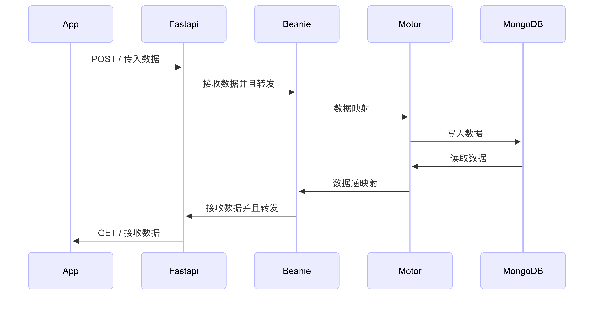

## 开始

https://github.com/mongodb/mongo

mongo 是一个相当活跃的社区。

而且我见过的不少优秀的博客系统似乎都是以 mongodb 作为数据库的。

它有自己独立的数据库编辑和查看工具 mongodb compass

https://github.com/mongodb-js/compass

当然最重要的是，它不同于 MySQL 的数据存储方式让我觉得很对胃口。它是非关系型数据库，它可以不断地"中途变卦",虽然这不是好习惯，但是，在开发一些特殊场景时，比如某天我希望给 Agent 增加一个功能，或者突然地想要新增一个功能且这个功能需要用到数据库。我并没有很早地为它规划出位置（我这人真的不善规划），那么我希望可以临时加入而不是再花费大量时间重新开始。

如果说 MySQL 就像一个严谨的一丝不苟但是不懂变通的老学究，那么 MongoDB 则更像是一个充满活力和创造力且包容力极强的导师。

如果你觉得我讲得过于抽象，那么请移步

[# MySQL vs MongoDB | 说起来我上次看 langchain and langraph 也是这个老头，真的是博而不精](https://www.youtube.com/watch?v=OdgZ0jr4jpM)

`https://www.youtube.com/watch?v=OdgZ0jr4jpM`

如果你希望更加专业和具体的:

https://www.geeksforgeeks.org/mongodb-vs-mysql/

> MongoDB 和 MySQL 都是流行的数据库管理系统（DBMS），但它们的用途不同，功能也各不相同。MongoDB 是一种 NoSQL 数据库，专为处理具有高扩展性的非结构化数据而设计，而 MySQL 则是一种传统的关系数据库管理系统（RDBMS），非常适合处理具有复杂关系的结构化数据。<br>
> 在本文中，我们将探讨 MongoDB 和 MySQL 之间的主要区别、它们的功能、用例以及如何决定哪一个最适合您的项目需求。我们还将深入探讨两者的优势和局限性，以便根据您的具体应用需求做出更明智的选择。<br>

## 安装和启动

我选择了 docker 。

```shell
docker pull mongo
docker run -d -p 27017:27017 mongon
```

然后查看状态:

```shell
➜  Downloads docker ps
CONTAINER ID   IMAGE     COMMAND                   CREATED       STATUS       PORTS                                           NAMES
5dfa55496560   mongo     "docker-entrypoint.s…"   4 hours ago   Up 4 hours   0.0.0.0:27017->27017/tcp, :::27017->27017/tcp   adoring_perlman
```

## MongoDB Compress

https://www.mongodb.com/products/tools/compass

下载用于可视化数据库的工具。当然不反对 `mongosh`。 但这里不教 0.0。

## What is ODM

> **ODM (Object Document Mapper)**，中文通常译作“对象文档映射器”，是一种用于在面向对象编程语言和文档型数据库之间进行数据转换的工具。简单来说，它允许开发者使用熟悉的面向对象语法（如类、对象、属性等）来操作文档型数据库中的数据，而无需直接编写数据库的查询语言（例如 MongoDB 的 BSON 查询语法）。<br>

简单说, 大多数时候面向数据库编程，包括之前在用 MySQL 的时候，大多代码量实际上浪费在了把 Python 数据结构存储到表中。比如说 str -> char(256) 一大堆的。以及有时候一个 TypedDict 可能要拆分到不同的表里面进行保存，而且有时候多个表用到的时候需要保存多次或者非常高深莫测的创建一个图映射。这块内容实际上很不友好。

更多时候实际上开发者更愿意把精力投入在要做的内容上，而不是数据库的管理上，而不严谨的设计还可能导致后续得推倒重来。比如发现 char 的长度不够用了，当然这是最简单的情况。

而 ODM 则让我们可以不必关心那么多。它让我们可以把一个 Python 的类直接地转换为可以存储到数据库中的类，有时候还简化了 CRUD 的操作。或者更加简单来说它减少了我们花费在数据库管理上的精力，让我们可以更加专注地开发我们想要的东西，而这正是我想要的。

https://www.mongodb.com/zh-cn/docs/drivers/

Mongo 有一个非常有活力的 ODM 社区。对于 Python , 我选用了 Beanie。

> - **Beanie：** Beanie 是一个异步的 MongoDB ODM，它基于 `Motor` (MongoDB 的异步驱动) 和 `Pydantic`。Beanie 的设计目标是提供一个现代、高效且易于使用的异步接口来操作 MongoDB。<br>

## 构建我们的 MongonDB 应用

### 架构

先说一下架构。我们实际上不希望直接操作数据库，或者说，大部分时候，我们希望看不见数据库里那些弯弯绕绕的。

所以这里我们大概用这样的架构:



我们大部分写应用的时候只关心我们的应用。对于 DB 的操作全部用 FastAPI 代理，这样也方便远程操作。

### 代码

https://juejin.cn/post/7112748113860755469

有的抄为何不抄

> 如果你发现它挂了也欢迎查看我的这个 PR ，它包含了这个用例。<br> > https://github.com/XnneHangLab/XnneHangLab/pull/39 <br>

中间碰到了这样的问题

### `422 Unprocessable Entity`

具体解法参见:

https://stackoverflow.com/questions/77262447/getting-error-422-unprocessable-entity-in-my-fastapi-python-demo-api

问题在于 ruff 建议我使用 `name: str | None` 来替代 `Optional[str]`. 而这两个在高版本(>=3.11)的 Python 中似乎和低版本中有出入。

具体表现为:

It's a bit unintuitive, but `Optional` in python only meanst that the value can also be `None`. It doesn't actually make `id` optional, to achieve that, you must provide a default value:

这有点不直观，但在 python 中， `Optional`  只表示该值也可以是  `None` 。 实际上，它并没有使  `id`  成为可选值，要做到这一点，必须提供一个默认值：

```python
from typing import Optional
from pydantic import BaseModel


class User(BaseModel):
    id: Optional[str] = None
    username: str
    email: str
```

意思是说，如果我没有给它指定 `= None` , 那么即使我的选项中存在 None `str | None`, Pydantic 依然会把它当作是 `str required`。

那么我在 put 的时候传入不完整的内容就会被阻止:

`{"detail":[{"type":"missing","loc":["body","date"],"msg":"Field required","input":{"name":"Abdulazeez Abdulazeez","product":"TestDriaven TDD Course","rating":5.0,"review":"hello"}}]}`

少什么就会报什么，并且，全量修改（传入所有的参数）不会引起这个错误。

解法就是在 `str | None` 这样后面显式赋值 None.

### PydanticObjectId 不能在 TYPE_CHECKING 中导入

```shell
INFO:     127.0.0.1:54664 - "GET /reviews/685a07eeb6cbcb170e710bea HTTP/1.1" 500 Internal Server Error
ERROR:    Exception in ASGI application
Traceback (most recent call last):
  File "/home/xnne/code/Chatter/XnneHangLab/.venv/lib/python3.12/site-packages/uvicorn/protocols/http/h11_impl.py", line 403, in run_asgi
    result = await app(  # type: ignore[func-returns-value]
             ^^^^^^^^^^^^^^^^^^^^^^^^^^^^^^^^^^^^^^^^^^^^^^
  File "/home/xnne/code/Chatter/XnneHangLab/.venv/lib/python3.12/site-packages/uvicorn/middleware/proxy_headers.py", line 60, in __call__
    return await self.app(scope, receive, send)
           ^^^^^^^^^^^^^^^^^^^^^^^^^^^^^^^^^^^^
  File "/home/xnne/code/Chatter/XnneHangLab/.venv/lib/python3.12/site-packages/fastapi/applications.py", line 1054, in __call__
    await super().__call__(scope, receive, send)
  File "/home/xnne/code/Chatter/XnneHangLab/.venv/lib/python3.12/site-packages/starlette/applications.py", line 112, in __call__
    await self.middleware_stack(scope, receive, send)
  File "/home/xnne/code/Chatter/XnneHangLab/.venv/lib/python3.12/site-packages/starlette/middleware/errors.py", line 187, in __call__
    raise exc
  File "/home/xnne/code/Chatter/XnneHangLab/.venv/lib/python3.12/site-packages/starlette/middleware/errors.py", line 165, in __call__
    await self.app(scope, receive, _send)
  File "/home/xnne/code/Chatter/XnneHangLab/.venv/lib/python3.12/site-packages/starlette/middleware/exceptions.py", line 62, in __call__
    await wrap_app_handling_exceptions(self.app, conn)(scope, receive, send)
  File "/home/xnne/code/Chatter/XnneHangLab/.venv/lib/python3.12/site-packages/starlette/_exception_handler.py", line 53, in wrapped_app
    raise exc
  File "/home/xnne/code/Chatter/XnneHangLab/.venv/lib/python3.12/site-packages/starlette/_exception_handler.py", line 42, in wrapped_app
    await app(scope, receive, sender)
  File "/home/xnne/code/Chatter/XnneHangLab/.venv/lib/python3.12/site-packages/starlette/routing.py", line 714, in __call__
    await self.middleware_stack(scope, receive, send)
  File "/home/xnne/code/Chatter/XnneHangLab/.venv/lib/python3.12/site-packages/starlette/routing.py", line 734, in app
    await route.handle(scope, receive, send)
  File "/home/xnne/code/Chatter/XnneHangLab/.venv/lib/python3.12/site-packages/starlette/routing.py", line 288, in handle
    await self.app(scope, receive, send)
  File "/home/xnne/code/Chatter/XnneHangLab/.venv/lib/python3.12/site-packages/starlette/routing.py", line 76, in app
    await wrap_app_handling_exceptions(app, request)(scope, receive, send)
  File "/home/xnne/code/Chatter/XnneHangLab/.venv/lib/python3.12/site-packages/starlette/_exception_handler.py", line 53, in wrapped_app
    raise exc
  File "/home/xnne/code/Chatter/XnneHangLab/.venv/lib/python3.12/site-packages/starlette/_exception_handler.py", line 42, in wrapped_app
    await app(scope, receive, sender)
  File "/home/xnne/code/Chatter/XnneHangLab/.venv/lib/python3.12/site-packages/starlette/routing.py", line 73, in app
    response = await f(request)
               ^^^^^^^^^^^^^^^^
  File "/home/xnne/code/Chatter/XnneHangLab/.venv/lib/python3.12/site-packages/fastapi/routing.py", line 291, in app
    solved_result = await solve_dependencies(
                    ^^^^^^^^^^^^^^^^^^^^^^^^^
  File "/home/xnne/code/Chatter/XnneHangLab/.venv/lib/python3.12/site-packages/fastapi/dependencies/utils.py", line 645, in solve_dependencies
    path_values, path_errors = request_params_to_args(
                               ^^^^^^^^^^^^^^^^^^^^^^^
  File "/home/xnne/code/Chatter/XnneHangLab/.venv/lib/python3.12/site-packages/fastapi/dependencies/utils.py", line 809, in request_params_to_args
    v_, errors_ = _validate_value_with_model_field(
                  ^^^^^^^^^^^^^^^^^^^^^^^^^^^^^^^^^
  File "/home/xnne/code/Chatter/XnneHangLab/.venv/lib/python3.12/site-packages/fastapi/dependencies/utils.py", line 706, in _validate_value_with_model_field
    v_, errors_ = field.validate(value, values, loc=loc)
                  ^^^^^^^^^^^^^^^^^^^^^^^^^^^^^^^^^^^^^^
  File "/home/xnne/code/Chatter/XnneHangLab/.venv/lib/python3.12/site-packages/fastapi/_compat.py", line 129, in validate
    self._type_adapter.validate_python(value, from_attributes=True),
    ^^^^^^^^^^^^^^^^^^^^^^^^^^^^^^^^^^^^^^^^^^^^^^^^^^^^^^^^^^^^^^^
  File "/home/xnne/code/Chatter/XnneHangLab/.venv/lib/python3.12/site-packages/pydantic/type_adapter.py", line 421, in validate_python
    return self.validator.validate_python(
           ^^^^^^^^^^^^^^^^^^^^^^^^^^^^^^
  File "/home/xnne/code/Chatter/XnneHangLab/.venv/lib/python3.12/site-packages/pydantic/_internal/_mock_val_ser.py", line 100, in __getattr__
    raise PydanticUserError(self._error_message, code=self._code)
pydantic.errors.PydanticUserError: `TypeAdapter[typing.Annotated[ForwardRef('PydanticObjectId'), Path(PydanticUndefined)]]` is not fully defined; you should define `typing.Annotated[ForwardRef('PydanticObjectId'), Path(PydanticUndefined)]` and all referenced types, then call `.rebuild()` on the instance.

For further information visit https://errors.pydantic.dev/2.11/u/class-not-fully-defined
```

ruff 建议移入 TYPE_CHEKING, 但是这样会导致错误。似乎是因为虽然我在代码中没有显式地用到 `PydanticObjectId` 但是它似乎被用到了。似乎是 Document 在处理 id 的时候用到。

它会间接导致所有直接利用到 id 的操作都抛出以上错误。包括 GET , DELETE, PUT 等。

### 映射 Document 的 `_id` 到 `id` 并且传入 TypedDict 存储

```python
@router.get("/", response_description="Review records retrieved")

async def get_reviews() -> list[ProductReviewDocument]:

	reviews = await ProductReviewDocument.find_all().to_list()

	return reviews
```

直接返回的是 Document，

`ProductReviewDocument(id=ObjectId('685a19c15819cbcb870e2498'), revision_id=None, name='张三', product='你好', rating=4.9, review='Excellent course! Updated review.', date=datetime.datetime(2025, 6, 24, 11, 21, 37, 643000)),`

大概长这样，里面的数据结构依然是 Document 的。不是标准的 Python Object。比如 str, float 之类。

我们利用 Pydantic 作为中间层把它转换成 TypedDict。

```python
from __future__ import annotations

from datetime import datetime

from beanie import Document, PydanticObjectId
from pydantic import BaseModel, Field


class ProductReview(BaseModel):
    id: str | None = None  # This is optional for the Pydantic model, but will be set by Beanie
    name: str
    product: str
    rating: float
    review: str
    date: datetime = datetime.now()


class ProductReviewDocument(Document):
    id: PydanticObjectId = Field(default_factory=PydanticObjectId)  # type: ignore
    name: str
    product: str
    rating: float
    review: str
    date: datetime = datetime.now()

    class Settings:
        name = "product_review"

    class Config:  # type: ignore
        json_schema_extra = {
            "example": {
                "id": "60c72b2f9b1e8d001c8e4a2f",
                "name": "Abdulazeez",
                "product": "TestDriven TDD Course",
                "rating": 4.9,
                "review": "Excellent course!",
                "date": datetime.now(),
            }
        }


class UpdateProductReview(BaseModel):
    # _id 不可以更新，因为它是唯一标识符
    name: str | None = None
    product: str | None = None
    rating: float | None = None
    review: str | None = None
    date: datetime | None = None

    class Config:
        json_schema_extra = {
            "example": {
                "name": "Abdulazeez Abdulazeez",
                "product": "TestDriven TDD Course",
                "rating": 5.0,
                "review": "Excellent course!",
                "date": datetime.now(),
            }
        }
```

值得注意的是， `ProductReview` 中的 `id: str | None = None` 这里我们让它默认为空，因为我们在 ADD，不希望自己定义 id ，而是让 Beanie 自动生成。 PUT 的时候不希望 id 被修改，应该它应该是不可修改的。这个 id 只是作为从 Document 中提取 id 时使用的一个中间层。

之后是处理 routes 的返回：

```python
# crud.py
def get_all_reviews() -> list[ProductReviewDict] | None:
    """
    Get all product reviews (GET /)
    """
    Logger.custom("获取所有产品评论", badge=Badge("LIST", fore="black", back="cyan"))
    url = f"{BASE_URL}/"
    try:
        response = requests.get(url)
        response.raise_for_status()
        reviews_json = response.json()
        Logger.info("所有评论:")

        parsed_reviews: list[ProductReviewDict] = []
        for review_data in reviews_json:
            try:
                if "_id" in review_data:
                    review_data["id"] = review_data.pop(
                        "_id"
                    )  # _id 似乎是 MongoDB 的默认字段名，而在 python 中我们的 _id 是被占用的。所以得把它转换为 id
                # Parse into Pydantic model first for validation, then to dict for TypedDict return type
                parsed_review = ProductReview.model_validate(review_data)
                parsed_reviews.append(ProductReviewDict(**parsed_review.model_dump(mode="json")))
            except Exception as e:
                Logger.error(f"解析单个评论时发生错误: {e} - Data: {review_data}")
                # Continue processing other reviews even if one fails
                continue

        for review in parsed_reviews:
            print(review)
        return parsed_reviews
    except requests.exceptions.RequestException as e:
        Logger.error(f"获取所有评论时发生错误: {e}")
        if hasattr(e, "response") and e.response is not None:
            Logger.error(f"错误响应: {e.response.text}")
        return None
    except Exception as e:
        Logger.error(f"解析所有评论列表时发生错误: {e}")
        return None
```

我把所有的 crud 都用调用 fastapi 实现。这里值得注意的是 Document 被转为 json 的时候 `id` 的字段是 `_id`: `{'_id': '685a19c15819cbcb870e2498', 'name': '张三', 'product': '你好', 'rating': 4.9, 'review': 'Excellent course! Updated review.', 'date': '2025-06-24T11:21:37.643000'}`

而 Pydantic 似乎不允许我们直接定义 `_id` 去接收，所以我们在做了手动转换 `_id` 为 `id`的操作。

> **Python 标识符约定：** 在 Python 中，以单个下划线开头的变量名（如 `_id`）通常表示“内部使用”或“私有”的约定。虽然这只是一个约定，但某些库或框架可能会对此有特定的处理。<br>
> Pydantic 默认情况下不期望处理以 `_` 开头的私有字段作为外部输入。<br>

#### Better Practice

为了更容易维护。我们应该选择直接在返回前就做这个转换而不是返回后再处理，类似这样:

```python
async def get_reviews() -> list[ProductReview]: # 直接返回 ProductReview
    reviews_docs = await ProductReviewDocument.find_all().to_list()
    # 将 Document 转换为 ProductReview
    # 这里的 to_dict(by_alias=True, exclude_none=True) 会将 id 变为 _id,
    # 然后 ProductReview.model_validate 可以利用 alias=“_id” 再次映射回来
    return [ProductReview.model_validate(doc.model_dump(by_alias=True, exclude_none=True)) for doc in reviews_docs]
```

并且我们应该返回一个 Pydantic BaseModel 而不是我们的 Document。

这个就要求我们修改 `ProductReview` 的定义使得它支持 `alias`:

```python
class ProductReview(BaseModel):
    id: PydanticObjectId | None = Field(
        default=None, alias="_id"
    )  # This is optional for the Pydantic model, but will be set by Beanie
    name: str
    product: str
    rating: float
    review: str
    date: datetime = datetime.now()
```

值得注意的是这个 `default=` 不能被省略，否则你会一直收到 pylance 的警告，它试图让你在初始化 ProductReview 实例时传参给 `_id`。虽然不加 `default=` None 也是传给了 default ，但这是因为：

> 这是因为 Pydantic 和 Pylance 对“隐式默认值”和“显式默认值”的处理方式不同。 <br>
> Field(None, alias="\_id") (隐式默认值):<br>
> 当你直接把 None 作为 Field 的第一个参数传入时，Pydantic 会将其识别为该字段的默认值。<br>
> 然而，对于像 id: str | None 这种带有类型提示联合（Union[str, None] 或 str | None）的字段，Pylance（以及 Pydantic 内部的一些校验逻辑）会认为它仍然可以作为一个可选的构造函数参数。Pylance 看到 id 在 **init** 方法的签名中是可选的，但如果你不提供它，它就会发出警告，因为你“可能忘记了”传入一个值，即使这个值可以是 None。它是在提醒你，这个字段可以被显式地赋值。<br>
> Field(default=None, alias="\_id") (显式默认值):<br>
> 当你明确地写出 default=None 时，你是在明确地告诉 Pydantic 和任何静态分析工具（如 Pylance）：这个 id 字段有一个预设的默认值 None，因此在创建 ProductReview 实例时，你不需要在构造函数中提供这个参数。<br>
> 通过 default= 关键字参数，你向 Pydantic 传达了一个更强烈的信号：这个字段是“有默认值的，可以不传”的，而不是“虽然可以是 None 但你仍然可以选择传一个值”的。Pydantic 内部会将其标记为“不需要在 **init** 中传入”的字段，从而 Pylance 也就不再发出警告。<br>

以及因为我们现在 validate 的对象不再是 response.json 而是直接的 Document 对象， 我们的 id 也需要 `str -> PydanticObjectId`。

最终我们的 get_all_reviews 变成了这样:

```python
def get_all_reviews() -> list[ProductReviewDict] | None:
    """
    Get all product reviews (GET /)
    """
    Logger.custom("获取所有产品评论", badge=Badge("LIST", fore="black", back="cyan"))
    url = f"{BASE_URL}/"
    try:
        response = requests.get(url)
        response.raise_for_status()
        reviews_json = response.json()
        Logger.info("所有评论:")

        parsed_reviews: list[ProductReviewDict] = []
        for review_data in reviews_json:
            try:
                # Parse into Pydantic model first for validation, then to dict for TypedDict return type
                parsed_review = ProductReview.model_validate(review_data)
                parsed_reviews.append(ProductReviewDict(**parsed_review.model_dump(mode="json")))
            except Exception as e:
                Logger.error(f"解析单个评论时发生错误: {e} - Data: {review_data}")
                # Continue processing other reviews even if one fails
                continue

        for review in parsed_reviews:
            print(review)
        return parsed_reviews
    except requests.exceptions.RequestException as e:
        Logger.error(f"获取所有评论时发生错误: {e}")
        if hasattr(e, "response") and e.response is not None:
            Logger.error(f"错误响应: {e.response.text}")
        return None
    except Exception as e:
        Logger.error(f"解析所有评论列表时发生错误: {e}")
        return None
```

不再需要手动转换 `_id` 为 `id`。

并且我们可以确认 response.json 就是 ProductReview， 所以用它直接去 validate 几乎不可能出错。

那么我们就可以把大部分 try-except 都去掉了，只保留 http 请求的异常处理。因为它不利于维护。

> 想起来一首歌: 死了都要 try! <br>
> 不 catch 到异常不痛快。<br> > https://www.bilibili.com/video/BV1CDJEzfEQ7/<br>

行吧， try 不是好习惯。至少在 Python 里是这样。它让你不会认真去思考为什么报错，让你不清楚具体是什么引起了它。有时候跑不通的代码 try 一下就通了。hh

即使使用 `try-except` 你应该确定到具体哪一行，以及是什么原因，然后自己给它 `ERROR` 提示。比如:

```shell
def get_all_reviews() -> list[ProductReviewDict] | None:
    """
    Get all product reviews (GET /)
    """
    Logger.custom("获取所有产品评论", badge=Badge("LIST", fore="black", back="cyan"))
    url = f"{BASE_URL}/"
    try:
        response = requests.get(url)
    except requests.exceptions.RequestException:
        Logger.error("请检查是否运行了 just db-server, 以及 MongoDB 服务是否运行正常")
        return None
    response.raise_for_status()
    reviews_json = response.json()
    Logger.info("所有评论:")

    parsed_reviews: list[ProductReviewDict] = []
    for review_data in reviews_json:
        # Parse into Pydantic model first for validation, then to dict for TypedDict return type
        parsed_review = ProductReview.model_validate(review_data)
        parsed_reviews.append(ProductReviewDict(**parsed_review.model_dump(mode="json")))
    return parsed_reviews
```

你应该对自己的代码有自信，或者说了如指掌，只要你确定它不会报错，那它就不会报错。

当然这大多时候是很难的，因为不可能所有代码都是你搓出来的。但是，至少在你掌控的部分，尽量做到 =-= 。

