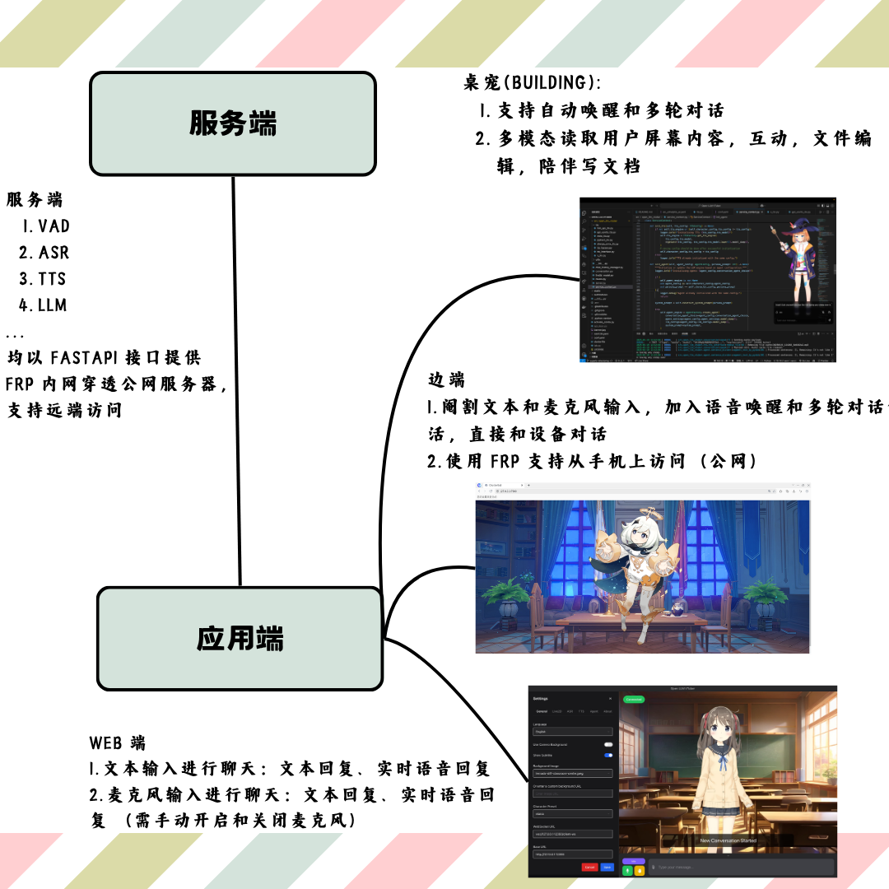
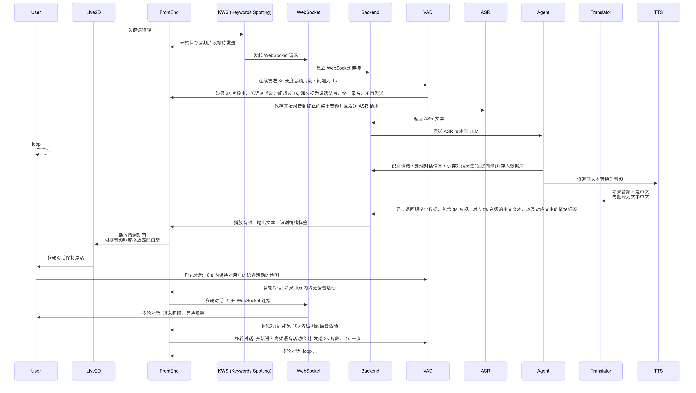

因为一直以来需求都停留在脑子里，所以每次要做一个东西都需要先把它想出来然后再做拆解，然后到这里已经觉得任务太复杂了感觉好难做。

这里是 ChatterBot 的设计工作流，包括已经实现的，和预期实现的。

仓库地址: https://github.com/XnneHangLab/Chatterbot

首先是架构:

然后是流程图:

这里的路径主要是边端实物端，加了关键词检测(KWS)和语音活动检测(VAD), 用来自动唤醒模型。
而 Web 端则是把原本直接语音唤醒功能换成了文字输入和手动的麦克风开启和关闭。

正在开发的桌宠端则是结合了边端和 Web 端，同时加入了多模态对桌面活动进行描述，以及加入一些文件读写权限。
## 服务端

源码位于:

https://github.com/XnneHangLab/XnneHangLab/

ASR, VAD 用的是阿里开源并且发布于 ModelScope 的:

[Paraformer语音识别-中文-通用-16k-离线-large-pytorch](https://modelscope.cn/models/iic/speech_paraformer-large_asr_nat-zh-cn-16k-common-vocab8404-pytorch)
[FSMN语音端点检测-中文-通用-16k](https://modelscope.cn/models/iic/speech_fsmn_vad_zh-cn-16k-common-pytorch/files)

TTS 本次使用的是 BERT-VITS2, 开源仓库位于[Bert-VITS2](https://github.com/fishaudio/Bert-VITS2), 派蒙模型使用原神的公开数据集微调而成。可以使用其他数据集自定义音色。

还准备了翻译模型，用于不同输入输出语言的处理。比如，希望音频输出是日文，那么大模型回复也得是日文，但是如果直接把大模型回复给用户，用户会看不懂，就需要先把输出日文翻译为中文然后返回给用户，文本是中文，但是音频是日文。但是因为数据集制作时间较少并没有准备其他语言的素材。

主要实现点在于对话历史记录和 RAG 数据库保存。这个一定程度上跳出了原本仅仅局限于一定字数的归纳式的记忆。

以及异步 tts 和文本生成。有时候文本很长，如果等待所有文本都生成完才发送 tts 请求，那么不仅等待文本时间长，等待音频生成的时间也长。这里采取的是流式生成 LLM 回复，按照标点按句生成音频并且通过 WebSocket 无缝传输给前端（通常播放完第一句时，已经生成好几句了。）

缺点在于情绪活动通常会在中途播放（接收完所有文本后才会生成情绪标签）而不是一开始播放。

## 应用端-边端

源码位于：

https://github.com/XnneHangLab/Chatterbot

主要实现点在于唤醒和自动录音停止以及多轮对话保持激活的方案。以及可以公网访问的同步 Live2d 模型。实际上可以开发成物联网，从手机上控制夜灯，但是由于时间并没有及时开发。

缺点在于唤醒词方案被周围的环境噪音影响较大。如果很吵，那么唤醒很困难。

而 VAD 语音活动检测方案的自动录音停止方案如果周围不断的有人讲话，哪怕不是被录音的人，那也会一直持续录音，把干扰人的音频也录进来。